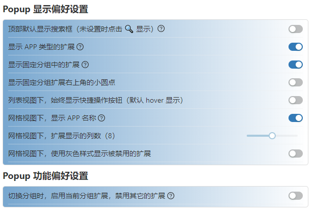

### 一步一步

在扩展管理器最早的版本发布到 Chrome 商店时，其实已经满足我自己的需求了，能够在飞书等页面上，禁用与之冲突的扩展，切换到其它页面时，再自动打开。

将扩展管理器自荐到 [小众软件](https://meta.appinn.net/t/topic/46198) 之后，意外收到了很多反馈和 [github issue](https://github.com/JasonGrass/auto-extension-manager/issues)。
后面发现，其实很多反馈都是来自 [扩展管理器（Extension Manager）](https://chrome.google.com/webstore/detail/extension-manager/gjldcdngmdknpinoemndlidpcabkggco ) 这一款工具的用户。

最开始在寻找扩展管理工具时，有试用过这个工具，但是其规则匹配那里好像有 BUG，另外许多交互逻辑和 UI 都没有看懂是什么意思，感觉很复杂，就弃用了。后面是在网友们提的需求中，才明白很多设计的意思。如

- 切换分组可以直接启用和禁用扩展

切换到指定分组，则启用分组中的所有扩展，并禁用掉其它所有的扩展。那如果有些扩展是需要常驻的呢？就将其加入到固定分组中，固定分组中的扩展，在切换分组时，可以不被禁用。

我自己没有这个功能的使用场景，所以一开始并不理解前辈的那个扩展管理工具中，固定分组是什么意思？还是得靠网友教。😂

- 扩展图标右上角的小圆点是什么意思

开始在试用上面的那个扩展管理器时，也完全不知道为什么会有一个小圆点，锁定又是什么意思？完全是一个不明觉厉的状态。其实这是和固定分组一起的概念，锁定就是将扩展放在固定分组中，小圆点就表示该扩展在固定分组中。

即使现在搞明白了，还是觉得有点复杂。不过，如果有手动切换分组管理扩展的需求，这些概念确是必要的。

- 网格视图

一开始的 Popup UI 设计，是参照 [快捷扩展管理 - Chrome 应用商店](https://chrome.google.com/webstore/detail/one-click-extensions-mana/pbgjpgbpljobkekbhnnmlikbbfhbhmem ) 来的，很简洁。

在我的想法中，所有的扩展启用与禁用，都应该交给规则自动化处理，平时在使用时，应该是不需要打开扩展管理工具手动操作的。但这或许与扩展使用达人的习惯是不符的，要不然为啥前辈的那个扩展管理工具，一上来那么复杂呢。
所以后面也添加的网格视图。

到目前为止，回过头来看，竟然已经实现了上面提到的扩展管理器中的大部分功能，可以算作是平替了，从规则配置的灵活性来说，还要更胜一筹。

比较有意思的是，因为很多功能我自己暂时用不上，所以就都加了配置，可以在配置中关掉。切换分组可以启用或禁用扩展，默认就是关掉的，哈哈。

---

在用户反馈中，有好几位提到了 [二管家 - Chrome 应用商店](https://chrome.google.com/webstore/detail/nooboss/aajodjghehmlpahhboidcpfjcncmcklf ) 这个工具，这是我之前不知道的，如果之前知道了，可能就不会自己开发现在这个扩展管理器了，因为满足了我之前最基本的需求。

用户反馈中提到的二管家中的功能，就是历史记录。确实，对于一个可以启用或禁用扩展的工具来说，应该要记录操作历史，可以清晰地看到扩展什么时候被启用或禁用了，是什么原因被启用或禁用。这个是下一步的工作内容，感觉并不简单，需要一些工作量。

另外的一个工作项，就是多语言了，现在所有的文案都直接写在了代码中，还没有做多语言的处理。

### 一些遗憾

现在最大的遗憾就是，缺一个视觉设计，虽然整体功能上 OK，但部分页面的视觉，还是差点意思 😂，以后看有没有机会研究一下，优化视觉体验。
