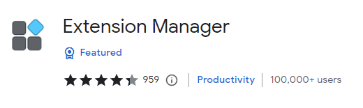

在早期寻找想要的扩展管理工具，以及后面开发的过程中，有小伙伴推荐，发现其实同类的工具还真不少。

不过很多工具都没有在维护了，目前来看，还是自己的这个工具最好用，哈哈哈。

以下是一些相似插件的整理和简要说明。

## 🍰 Extension Manager

首先不得不提的是有 100 000+ 用户的 Extension Manager，

最后更新时间：2021年11月4日  

<https://chrome.google.com/webstore/detail/extension-manager/gjldcdngmdknpinoemndlidpcabkggco>

功能本身是 OK 的，但是规则匹配那里过于简单，而且似乎有 BUG，无法满足我最开始的需求。在开发中，有很多小伙伴提的需求和建议，都是来源于这个工具。

不过，这个工具被爆有不受欢迎的行为：[Chrome 插件“扩展管理器(Extension Manager)”开始在后台标签页偷偷弹广告 - V2EX](https://www.v2ex.com/t/684433#reply18 )，可能这是后面作者没有再维护的原因吧。

## 🍰 One Click Extensions Manager

一个很简洁的手动扩展管理工具，在 Popup 弹窗中，实现扩展的手动打开和关闭。简单轻量。  

[hankxdev/one-click-extensions-manager: a simple chrome extension to manage chrome extension](https://github.com/hankxdev/one-click-extensions-manager )  

<https://chrome.google.com/webstore/detail/one-click-extensions-mana/pbgjpgbpljobkekbhnnmlikbbfhbhmem>

最后更新时间：2023年7月26日（所以应该是还在维护更新中）

## 🍰 二管家

这个是我开始开发之后，有网友提到的一个扩展，有基础的扩展管理功能。如果一开始发现了这个工具，可能我就不会想要重新开发了，因为这个工具的规则功能（如果没有 BUG 的话），其实可以满足我最开始的需求了。

不过这个扩展的所有操作都在 Popup 中，执行与设置没有分开，界面也不够简洁。

[二管家 - Chrome 应用商店](https://chrome.google.com/webstore/detail/nooboss/aajodjghehmlpahhboidcpfjcncmcklf )  

最后更新时间：2022年3月21日

## 🍰 SimpleExtManager

一个功能还挺丰富的扩展，也是开始开发之后，网友在 issue 中提到的。

[SimpleExtManager - Chrome 应用商店](https://chromewebstore.google.com/detail/simpleextmanager/kniehgiejgnnpgojkdhhjbgbllnfkfdk )  

最后更新时间：2021年6月12日

## 其它

当然，除了以上的扩展，还有很多，在 Chrome 商店中，搜索 Extension Manager，能搜索出非常多的相关扩展。不过大多都很久没有更新了，功能也欠佳。
