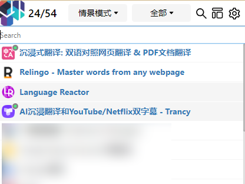
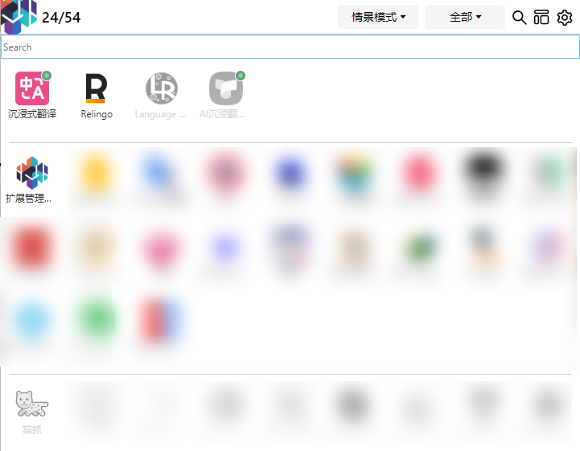

# 高级功能

## 置顶显示扩展

在规则配置的动作选项中，可以配置在条件匹配时，将目标扩展在 Popup 中置顶显示。

效果如下：

最上面的是置顶的扩展，中间是当前启用的扩展（不包括置顶的扩展），最下方是当前禁用的扩展（不包括置顶的扩展）。

此功能的场景是什么？

如果你对同一站点，可能使用到多个扩展（如上图示例中的翻译类扩展），并且需要手动控制其开关，则这个功能可以直观展示相关扩展，方便快速定位。

:::info
1 在规则设置中，如果不定义自动的启用与禁用功能，则动作类型可以选 “无”，这个规则就只有设置置顶的功能了

2 置顶功能只会匹配当前标签的 URL，不会匹配其它标签页的 URL。
:::
