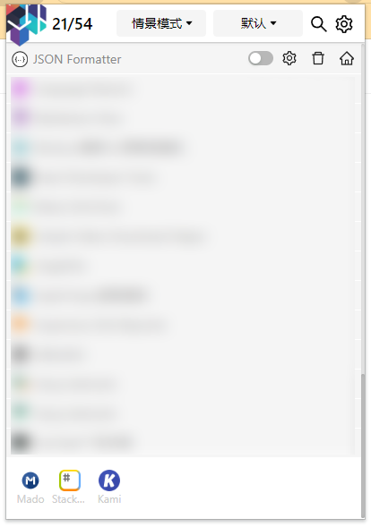

# Popup

## Header

`21/54` 表示一共有 54 个扩展（不包括扩展管理器自身，不包括 APP 类型的扩展，不包括主题类型的扩展），其中启用的有 21 个。

:::tip
如果在通用设置中，设置了在 Popup 中不显示固定分组中的扩展，则这里的数字，不包括固定分组中扩展的数量。
:::

### 情景模式

如果添加了情景模式，则会出现情景默认切换菜单。可以切换当前激活的情景模式。配合规则的设置，可以实现扩展的自动启用与禁用。

### 分组

默认情况下，切换分组，只是展示当前分组下的扩展，而不会启用或禁用扩展。

如果期望在切换分组时，启用分组中的扩展，并禁止其它扩展，请在设置中打开相应的配置。

### 搜索

点击搜索按钮，或者按下 `F`，可以打开搜索框，进行扩展的搜索。

如果在设置中为扩展配置了别名或备注，也支持搜索。

搜索框默认不显示，如果希望搜索框默认显示，可以在设置中打开配置。

## 扩展列表

扩展按照启用的在前，禁用的在后显示。排序规则：先中文（按拼音排序），后英文（按字母排序）。

如果设置了别名，将显示别名，并按照别名排序。

## APP 类型的扩展

默认不显示 APP 类型的扩展，如果需要显示，请在设置中打开配置。

点击 APP 类型的扩展图标，可以打开对应的 APP。

:::tip
如果点击图标无法打开 APP，  
1 APP 可能被禁用了，请先在浏览器的扩展管理中，打开 APP。  
2 APP 可能已经不被兼容，可以在地址栏打开 `chrome://apps/` 查看详情
:::
