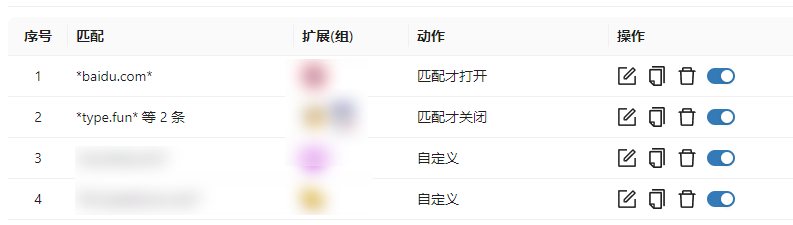
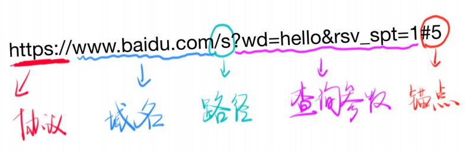
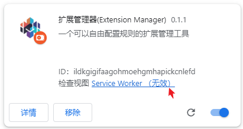

# 规则设置

## 规则列表

在每条规则的后面，有 `编辑` `副本` `删除` `开关` 四个按钮，可以对规则进行编辑、新建副本、删除、开启/关闭。

## 1 匹配条件

在浏览器打开，浏览器标签切换，手动切换情景模式等时刻，都会出现规则的匹配计算与执行。这里的匹配条件，就是在触发规则执行时，判断当前规则是否满足条件。

如果条件满足，则会执行 `动作` 配置中，条件满足时的动作（也可能没有动作）。
如果条件不满足，则会执行 `动作` 配置中，条件不满足时的动作（也可能没有动作）。

### 1.1 URL 匹配

这个是最常用的匹配模式，默认匹配的是当前页面的 URL，也可以匹配任意 URL。具体可以在动作配置中设置。

:::caution
这里的 URL 匹配，只计算了 URL 的协议，域名和路径部分，**不包括** 查询参数和锚点部分。

:::

如果你有一些处理本地文件的扩展，也可以使用类似 `*file://*.pdf*` 这样的设置来进行配置。

### 1.2 情景模式匹配

匹配当前设置的情景模式，具体可以参考 [情景模式](./scene.md)

### 1.3 操作系统

可以用来仅在指定的操作系统上，开启或禁用部分扩展。

### 1.4 时间区间

浏览器为了性能考虑，在静置一小段时间后，扩展的后台逻辑就会被休眠。如果扩展想要执行后台逻辑，需要等待浏览器事件的触发，如打开/关闭/切换标签等。

所以，对于时间区间的匹配而言，实际的规则执行时间可能是不准确的，只能作为非精确场景下使用。

:::caution
假如设置了在 17:00 - 18:00 启用某个扩展，但在 17:00 到来之后，浏览器都是静置状态，则规则无法被执行。如果在 17:20 时，切换了标签页，则此时才会执行规则，启用扩展。
:::

## 2 规则执行目标

设置规则执行的目标扩展，可以选择多个扩展或扩展组，最终执行时会去重。

:::tip
在规则配置中，扩展是否会被禁用，仅由规则决定，与扩展是否在固定分组中没有关系。
:::

## 3 动作

### 3.1 匹配后关闭、匹配后打开、匹配才关闭、匹配才打开

这几个比较好理解，需要特别说明的是，其中 URL 的匹配，是只当前标签的 URL，切换标签之后，就可能导致规则不匹配。

举例：配置了一条规则，当打开 `*cnblogs.com*` 时，启用阅读模式扩展（如简阅），如果此时正在阅读文章 [https://www.cnblogs.com/cmt/p/17520031.html](https://www.cnblogs.com/cmt/p/17520031.html)，则扩展会被打开。

但这期间，很有可能我们会切换到其它标签页，如果动作设置成 `匹配才打开`，则切换标签之后，扩展就会被关闭，重新切回来时，扩展还需要重新加载，这会降低体验。
而如果设置成 `匹配后打开` 则扩展被打开之后，就不会自动关闭了，除非我们手动关闭。

此时，更理想的情况应该是：在当前标签匹配时，打开扩展，在所有标签中，都没有任何匹配时，关闭扩展。这就需要自定义动作了。

### 3.2 自定义

可以自定义启用插件和禁用插件的时机，重点是，可以配置 URL 的匹配计算方式。

怎么样算匹配？怎么样算不匹配？在这里可以明确指定。

### 3.3 刷新设置

如一些阅读模式类的扩展，在开启之后，如果没有效果，可能需要刷新一次页面。在这里可以配置自动刷新。
