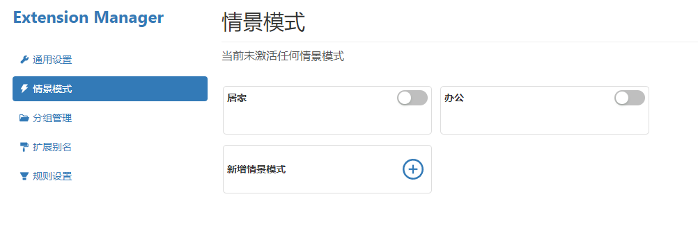

# 情景模式

在扩展设置界面，可以添加情景模式。情景模式本身没有任何功能，需要配合规则来实现扩展的启用与禁用。

如，期望在公司上班时，自动打开某些扩展，家里的电脑上，就关闭这些扩展。就可以设置公司办公电脑为 `办公` 模式，家里的电脑为 `居家` 模式。

然后通过规则的设置，实现在不同的电脑上，打开不同的扩展这个功能。

:::tip
当前激活的情景模式，只会保留在本地，不会同步。  
如，在办公室电脑上打开了 `办公` 模式，在家庭电脑上，并不会自动也打开 `办公` 模式，还是会保留在家庭电脑上情景模式的设置。
:::
