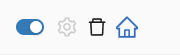

# 通用设置

### 排序：按照启用频率进行排序

默认情况下，按照扩展名进行排序，中文在前，英文在后，中文按照拼音排序。

如果开启按照启用频率排序，则最近手动开启次数多的，会排序在前，剩余的按照名称排序。

具体是如何计算的？

在 Popup 中手动启用扩展，将被记录一次（数据保存在本地计算机上），禁用扩展不记录。在最近的 100 次手动启用扩展的操作中，次数最多的在前。

### HOME 按钮始终打开扩展的应用商店详情页

对于此 HOME 按钮，点击时，默认会打开扩展配置信息中的 `homepage` URL，此 URL 有可能是扩展的应用商店详情链接，也可能是作者配置的其它链接，如 github 链接或者自定义网站。

如果你期望点击此 HOME 按钮时，打开的页面始终是应用商店的详情页面，可以开启这个配置。
